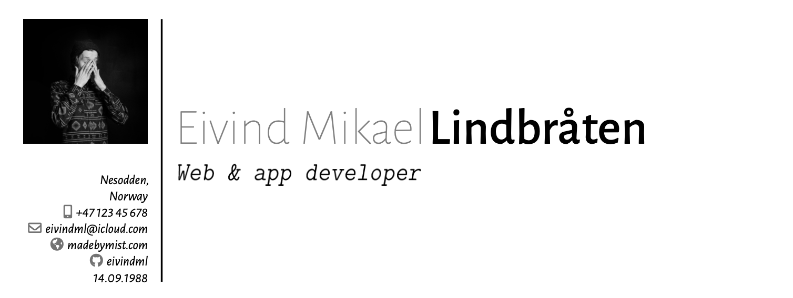

# 

<p align="center">

<a href="license">

</a>

<a href="https://www.paypal.me/eivindml">

</a>

<br />
<br />
</p>

<p align="center">
Personal CV. Created to be modular, so it's really simple and quick to add/remove sections, just by commenting one line. The PDF output can be found [here in the build folder](build/eivindml-cv.pdf).

<br />
<br />
</p>

## Table of Contents

- [CV](#)
    - [Table of Contents](#table-of-contents)
    - [Usage](#usage)
    - [Dependencies](#installation)
    - [License](#license)

## Usage

Make sure all dependencies are installed. Build the CV using the Makefile:

```bash
make          # Build the PDF
make clean    # Remove temporary files
make watch    # Watch for changes and rebuild (requires entr)
make open     # Build and open the PDF (macOS)
```

You can also compile `src/eivindml-cv.tex` directly with your favorite TeX/LaTeX engine.

## Dependencies

Building requires `pdflatex` to be installed on your system. The TeX document depends on the [moderncv](https://www.ctan.org/pkg/moderncv?lang=en) LaTeX package for styling. Install it with:

```bash
sudo tlmgr install moderncv
```

To use the Alegreya Sans font used in this document:

```bash
sudo tlmgr install alegreya fontaxes
```

For the `make watch` target, install `entr`:

```bash
brew install entr  # macOS
```

## License

[MIT](license) © [Eivind Lindbråten](http://madebymist.com)
