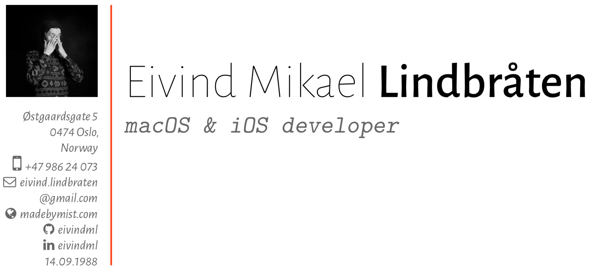

# CV

Personal CV. Created to be modular, so it's really simple and quick to add/remove sections, just by commenting one line.

The PDF output can be found [here in the build folder](build/eivindml-cv.pdf).

## Usage

Compile `eivindml-cv.tex` with your favorite TeX/LaTeX engine, or use the automated gulp build script, by running:

`npm install` to install required dependencies.

Then run `gulp` or `gulp watch` compile the document.

## Dependencies

The automated gulp build script in `gulpfile.js` requires the `pdflatex` distribution to run.

The TeX document depends on the [moderncv](https://www.ctan.org/pkg/moderncv?lang=en) (for styling) latex package to be available to the system, and the [apple_emoji](https://github.com/alecjacobson/coloremoji.sty) package (for hacky Apple Emoji support 🙌).
